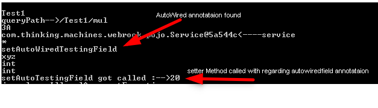
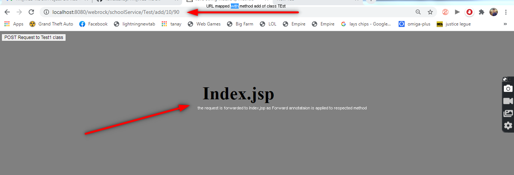
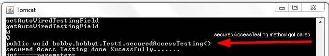
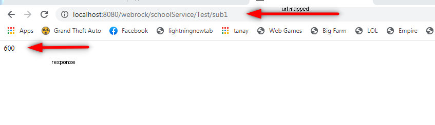
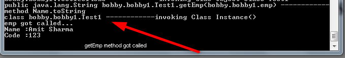
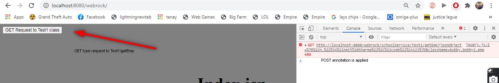
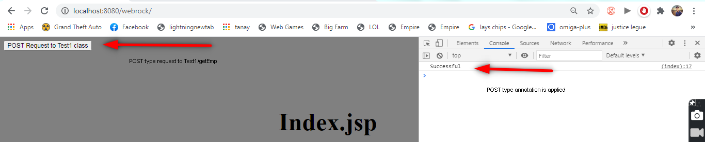

#### TM_WEB-ROCK
TM_WEB-ROCK is an open source Java-based framework used to create a micro Service and is used to build stand-alone and production ready spring applications.Micro Service is an architecture that allows the developers to develop and deploy services independently. Each service running has its own process and this achieves the lightweight model to support business applications.
TM_WEB-ROCK provides a good platform for Java developers to develop a stand-alone and production-grade application that you can just run. You can get started with minimum configurations.

# Usage and Examples
# Providing/Mapping the name of the folder to the classes
```
<context-param>
<param-name>SERVICE_PACKAGE_PREFIX</param-name>
<param-value>..package-Name..</param-value>
</context-param>
```
# Providing/Mapping the name StartingUp classs:TM_WEB-ROCK Starter_class
```
<servlet>
<servlet-name>START_UP_SERVLET</servlet-name>
<servlet-class>com.thinking.machines.webrock.TMWebRockStarter</servlet-class>
<load-on-startup>0</load-on-startup>
</servlet>
<servlet-mapping>
<servlet-name>START_UP_SERVLET</servlet-name>
<url-pattern>/TMWebRockStarter</url-pattern>
</servlet-mapping>
```
#  Providing/Mapping the name of js file to load to servlet class 'getJsFile' 
here Department.js is the file to be mapped
```
<context-param>
<param-name>JS_FILE</param-name>
<param-value>Department.js</param-value>
</context-param>
```


#  Mapping up 'jsFile' Servlet with url as needed by user

```
<servlet>
<servlet-name>JSFILE</servlet-name>
<servlet-class>com.thinking.machines.webrock.jsFile</servlet-class>
<load-on-startup>1</load-on-startup>
</servlet>

<servlet-mapping>
<servlet-name>JSFILE</servlet-name>
<url-pattern>/jsFile</url-pattern>
</servlet-mapping>
```

# Mapping the getJs File to be loaded from servlet
```
<servlet>
<servlet-name>GETJSFILE</servlet-name>
<servlet-class>com.thinking.machines.webrock.getJsFile</servlet-class>
</servlet>

<servlet-mapping>
<servlet-name>GETJSFILE</servlet-name>
<url-pattern>/getJsFile/*</url-pattern>
</servlet-mapping>
```

#  Mapping up the Services of classes to url pattern(custom) that provides all the services
here url-Pattern :/schoolService ,class provided: 'com.thinking.machines.webrock.TMWebRock'

```
<servlet>
<servlet-name>Service</servlet-name>
<servlet-class>com.thinking.machines.webrock.TMWebRock</servlet-class>
</servlet>

<servlet-mapping>
<servlet-name>Service</servlet-name>
<url-pattern>/schoolService/*</url-pattern>
</servlet-mapping>
```


# Getting js File mapped through Servlet
here jsFile :'Department.js'
```
<script src='getJsFile?name=Department.js'></script>
```

#  Loading the classes to their priority provided by user using @Startup(priority=number)
here class bbb will be loaded first then aaa according to priority: having '1' highest priority
```
@Startup(priority=4)
Class aaa
{
}
---------------
@Startup(priority=1)
Class bbb
{
}
```

# Providing Path to classes using @Path("")
```
@Path("/Test")
public class Test
{
}
```
# Declaring to inject Session Scope using @injectSessionScope
```
@injectSessionScope
class Test
{
private SessionScope sessionScope;
public void setSessionScope(SessionScope sessionScope)
{
this.sessionScope=sessionScope;
System.out.println("set Session Scope method got called ");
}
}//class Test ends
```
# Declaring to inject ApplicationScope or RequestScope using @injectApplicationScope and @injectRequestScope
```
@injectApplicationScope
class Test
{
private ApplicationScope applicationScope;
public void setRequestScope(ApplicationScope sessionScope)
{
this.applicationScope=applicationScope;
System.out.println("set Application Scope method got called ");
}
}//class Test ends
```
#  Mapping path to methods
```
@Path("/add")
public int add(int a,int b)
{
return a+b;
}
```

#  Mapping method to forward to another Method or jsp or etc..
```
@Forward("/index.jsp")
@Path("/add")
public int add(int a,int b)
{
return a+b;
}
```
#  Setting up the class to be accept GET or POST type request
```
@GET or @POST
@Path("/aaa")
class aaa
{
}
```
#  Providing Secured Access to method that have to run before the method mapped with it
here class-Name: bobby.Test 
here method-Name: checkLoginStatus
```
@SecuredAccess(checkPost="bobby.Test",gaurd="checkLoginStatus")
public void getStudent
{
//
}
```
# setting up the @JSON if the method accepts customClass Object or json
```
@JSON
public void printStdentDetails(Student student)
{
System.out.println(student.name);
}
```

# setting up @RequestParameter if the method requests parameter from the scope
```
public int sub1(@RequestParameter("aaa")int a,@RequestParameter("bbb")int b)
{
return a-b;
}
```
#  Providing value to be assigned to a field from Application,Session or RequestScope   :@AutoWired 
Uses CamelCase methods Names for setters and getters
```
Path("\aaa")
class aaa
{
@AutoWired(name="xyz")
private int autoWiredTestingField;
public void setAutoWiredTestingField(int x)
{
this.autoWiredTestingField=x;
System.out.println("setAutoTestingField got called---------------"+this.autoWiredTestingField);
}
}//class aaa ends here
```

###  Getting All the Services/Paths Provding to the annoted Classes And methods using TM_WEB-ROCK for exceution of the Services

uses tmrock.jar
pdf-Name: Services_Doc.jar
```
javac -classpath tmrock.jar;. ...path to the classes  ....path to the pdf to be generated

example: arg[0]--> give the absolute or relative path to folder containing classes ,arg[1]--> give the path for generated pdf to be saved named as SeviceS_Doc.pdf 

>javac -classpath tmrock.jar;c:\itext7\*; c:\tomcat9\webapps\webrock\WEB-INF\classes\bobby c:\tomcat9\webapps\webrock\pdf
```

# Example :class Test
```
folder: WEB-INF/classes/bobby

package bobby;
import com.thinking.machines.webrock.annotations.*;
import com.thinking.machines.webrock.*;
import com.thinking.machines.webrock.model.*;
import com.thinking.machines.webrock.services.*;
@GET
@Startup(priority=4)
@Path("/Test")
@injectSessionScope
public class Test
{
private SessionScope sessionScope;
public void setSessionScope(SessionScope sessionScope)
{
this.sessionScope=sessionScope;
System.out.println("set Session Scope method got called ");
}
@Forward("/index.jsp")
@Path("/add")
public int add(int a,int b)
{
return a+b;
}
@POST
@Path("/sub1")
@SecuredAccess(checkPost="bobby.Test",gaurd="getStudent")
public int sub1(@RequestParameter("aaa")int a,@RequestParameter("bbb")int b)
{
return a-b;
}
@POST
@Path("/sub")
public int sub(int a,int b)
{
return a-b;
}
@Forward("/Test1/add/10/90/200")
@Path("/mul")
public int mul(int a,int b)
{
return a*b;
}

@Path("/getStudent")
@JSON
public void getStudent(RequestScope rs,SessionScope ss,ApplicationScope as)
{
System.out.println("test_1 got called.....................");
//System.out.println(i.name);
//System.out.println(i.code);
System.out.println(rs);
System.out.println(ss);
System.out.println(as);
}
public static void main(String gg[])
{
System.out.println("Class test is executed with Prority:        4");
}
}//class eg1
```
 Example class emp
```
folder WEB-INF/bobby/bobby1

package bobby.bobby1;
import com.thinking.machines.webrock.annotations.*;
import com.thinking.machines.webrock.*;
import com.thinking.machines.webrock.model.*;
import com.thinking.machines.webrock.services.*;
@Path("/emp")
public class emp
{
private String name;
private int code;
@Path("/getName")
public String getName()
{
return this.name;
}
public String setName()
{
return this.name;
}
}

```
# Example :class Test1
```
folder WEB-INF/classes/bobby/bobby1

package bobby.bobby1;
import com.thinking.machines.webrock.annotations.*;
import com.thinking.machines.webrock.*;
import com.thinking.machines.webrock.model.*;
@injectSessionScope
@injectApplicationScope
@GET
@Path("/Test1")
public class Test1
{
public void securedAccessTesting()
{
System.out.println("secured Acess Testing done Sucessfully.......");
}
@AutoWired(name="xyz")
private int autoWiredTestingField;
public void setAutoWiredTestingField(int x)
{
this.autoWiredTestingField=x;
System.out.println("setAutoTestingField got called---------------"+this.autoWiredTestingField);
}
public int getAutoWiredTestingField()
{
return this.autoWiredTestingField;
}
@Path("/add")
public int add(int a,int b,int z)
{
return a+b+z;
}
@Path("/sub")
public String sub(int a,int b)
{
return "subtract method got called and subtration is : "+(b-a);
}
@Path("/mul")
public int mul(int a,int b,int c)
{
return a*b*c;
}
@Path("/emp1")
public void emp1(emp e)
{
System.out.println("emp got called");
}
public static void main(String gg[])
{
System.out.println("Class test1 is executed with Prority:        3");
}
}//class eg1
```

# Starting the server
")
# Execution of methods: 1
)")
# Execution of methods: 2
)")
# Execution of @AutoWired
```
@Path("/Test1")
@Startup(priority=1)
public class Test1
{
public void securedAccessTesting()
{
System.out.println("secured Acess Testing done Sucessfully.......");
}
@AutoWired(name="xyz")
private int autoWiredTestingField;
public void setAutoWiredTestingField(int x)
{
this.autoWiredTestingField=x;
System.out.println("setAutoTestingField got called :-->"+this.autoWiredTestingField);
}
}//class Test1
```

# Execution of Forward Annotation
As @Forward("/index.jsp") is applied on add(int,int) of Test class thats why after execution of 'add' method it is forwarded to 'index.jsp'


# @RequestScope and Security
```
Default: request.setAttribute("aaa",1000);
Default: request.setAttribute("aaa",600);

package bobby;
class Test
@Path("/sub1")
@SecuredAccess(checkPost="bobby.bobby1.Test1",gaurd="securedAccessTesting")
//@Forward("/Test1/add/10/90/200")
public int sub1(@RequestParameter("aaa")int a,@RequestParameter("bbb")int b)
{
return a-b;
}
}//class Test
```
```
package bobby.bobby1;
public class Test1
{
public void securedAccessTesting()
{
System.out.println("secured Access Testing done Sucessfully.......");
}
```


# Secured method got called



# JSON in request(@JSON)
.jsp file
```
<script>
$(()=>{
$("#b1").click(function(){
var jsonString=JSON.stringify({"name":"Amit Sharma","code":123});
$.ajax({
        type: "POST",
        url: "/webrock/schoolService/Test1/getEmp",
        data: {jsonObject:jsonString,className:"bobby.bobby1.emp"},
        success: function(result) {
            window.console.log('Successful');
        }
    });

```
.class file
```
@JSON
@Path("/getEmp")
public String getEmp(emp e)
{
String qq="";
System.out.println("emp got called...");
qq+="Name :"+e.name+"\n";
qq+="Code :" +e.code+"\n";
return qq;
}
```


# Declaring and Securing Classes and Methods to be accept GET/POST request 




